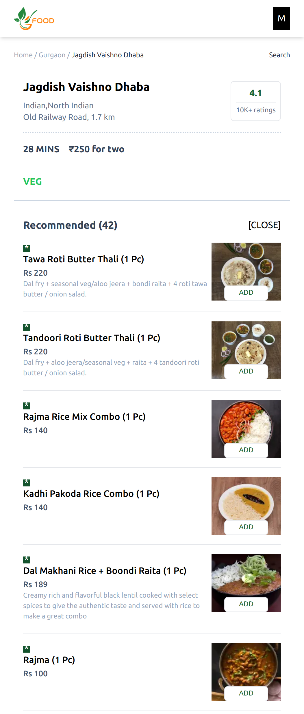

# Food-Ordering-App

A Swiggy-like video streaming app using React, Redux &amp; Tailwind CSS.

### Basic Overview [➥ Live Demo](https://food-webapp121.netlify.app/)

In this project I have used Swiggy live API to fetch all the data through CORS.

- `React js` as a UI library.
- `Redux toolkit` for state management.
- `React router-V6` for routing.
- `Tailwind CSS` for styling.
- Parcel for bundling.
- `Completely responsive`.
- `React testing library` for unit testing and integration testing.

## Screenshots

 

